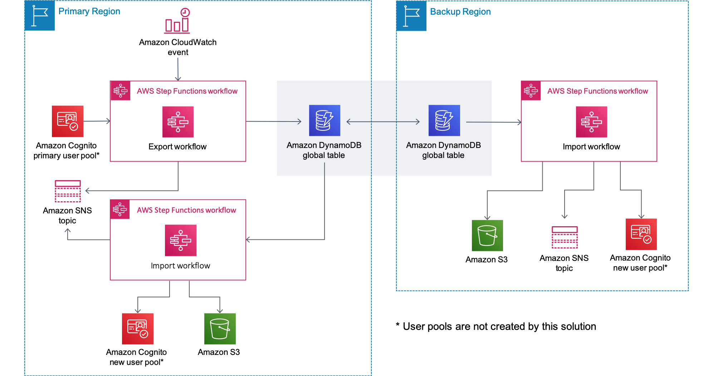

⚠️🚨⚠️ __Cognito User Profiles Export Reference Architecture will no longer be supported starting on March 1, 2025 and will not receive any additional features.__ ⚠️🚨⚠️

# Cognito User Profiles Export Reference Architecture
This solution uses an [AWS Step Functions](https://aws.amazon.com/step-functions/) workflow (`ExportWorkflow`) to periodically export user profiles, groups, and group membership details from your user pool to an [Amazon DynamoDB global table](https://aws.amazon.com/dynamodb/global-tables/) with automatic, asynchronous replication to a backup Region for added resiliency. This solution is designed to provide a framework for exporting user profile and group information from your user pool, allowing you to focus on extending the solution’s functionality rather than managing the underlying infrastructure operation. 

This solution’s `ImportWorkflow` Step Functions workflow can be used to populate a new, empty user pool with data from the global table, allowing you to easily recover user profiles, groups, and group memberships. The `ImportWorkflow` Step Functions workflow can be run in either the primary or backup Region.

> **_NOTE:_**  Some data loss will result when running the `ImportWorkflow` Step Functions workflow because this solution runs periodically. For example, if you schedule exports daily, you will lose up to a day’s worth of user pool updates depending on when the `ImportWorkflow` Step Functions workflow was run.

For more information and a detailed deployment guide visit the [solution home page](https://aws.amazon.com/solutions/implementations/cognito-user-profiles-export-reference-architecture/).

## On This Page
- [Architecture Overview](#architecture-overview)
- [Getting Started](#getting-started)
- [File Structure](#file-structure)
- [Collection of operational metrics](#collection-of-operational-metrics)
- [License](#license)

## Architecture Overview



## Getting Started
### 1. Prerequsites
The following procedures assumes that all of the OS-level configuration has been completed. They are:
- [AWS Command Line Interface](https://aws.amazon.com/cli/)
- Node.js 18.x

The Cognito User Profiles Export Reference Architecture is developed with Node.js for the microservices that run in AWS Lambda. The latest version has been tested with Node.js 18.x.

### 2. Clone the Cognito User Profiles Export Reference Architecture repository
Clone the ```cognito-user-profiles-export-reference-architecture``` GitHub repositroy, then make the desired code changes.

```bash
git clone https://github.com/aws-solutions/cognito-user-profiles-export-reference-architecture.git
```

### 3. Run unit tests
* Next, run unit tests to make sure added customization passes the tests.
```bash
cd ./deployment
chmod +x ./run-unit-tests.sh
./run-unit-tests.sh
```

### 4. Declare environment variables
```bash
export REGION=aws-region-code # the AWS region to launch the solution (e.g. us-east-1)
export SECONDARY_REGION=aws-region-code # the AWS region that will serve as backup (e.g. eu-central-1)
export DIST_OUTPUT_BUCKET=my-bucket-name # bucket where customized code will reside
export SOLUTION_NAME=my-solution-name
export VERSION=my-version # version number for the customized code
```

_Note:_ When you define `DIST_OUTPUT_BUCKET`, a randomized value is recommended. Below, you will create two S3 buckets using this value in the two regions you want to use. 

### 5. Create an Amazon S3 bucket
The AWS CloudFormation template is configured to pull the AWS Lambda deployment packages from Amazon S3 bucket in the region the template is being launched in. Create a bucket in the desired region name appended to the name of the bucket. _Note:_ you must have the AWS Command Line Interface installed.
```bash
aws s3 mb s3://$DIST_OUTPUT_BUCKET-$REGION --region $REGION
aws s3 mb s3://$DIST_OUTPUT_BUCKET-$SECONDARY_REGION --region $SECONDARY_REGION
```

### 6. Build the Cognito User Profiles Export Reference Architecture for deployment
```bash
chmod +x ./build-s3-dist.sh
./build-s3-dist.sh $DIST_OUTPUT_BUCKET $SOLUTION_NAME $VERSION
```

### 7. Upload deployment assets to your Amazon S3 bucket
* If your S3 buckets were previously created, you can verify bucket ownership before uploading assets. No output from the `s3api` commands below indicates expected ownership. Unexpected owners will result in an error.

```bash
export ACCOUNT_ID=$(aws sts get-caller-identity --query Account --output text)
aws s3api head-bucket --bucket $DIST_OUTPUT_BUCKET-$REGION --expected-bucket-owner $ACCOUNT_ID
aws s3api head-bucket --bucket $DIST_OUTPUT_BUCKET-$SECONDARY_REGION --expected-bucket-owner $ACCOUNT_ID
```

* Deploy the distributable to an Amazon S3 bucket in your account. _Note:_ you must have the AWS Command Line Interface installed.
```bash
aws s3 cp ./regional-s3-assets/ s3://$DIST_OUTPUT_BUCKET-$REGION/$SOLUTION_NAME/$VERSION/ --recursive --acl bucket-owner-full-control
aws s3 cp ./regional-s3-assets/ s3://$DIST_OUTPUT_BUCKET-$SECONDARY_REGION/$SOLUTION_NAME/$VERSION/ --recursive --acl bucket-owner-full-control
```

### 8. Launch the Cognito User Profiles Export Reference Architecture
- Get the link of cognito-user-profiles-export-reference-architecture.template uploaded to your Amazon S3 bucket.
- Deploy the Cognito User Profiles Export Reference Architecture to your account by launching a new AWS CloudFormation stack using the S3 link of cognito-user-profiles-export-reference-architecture.template.

## File Structure
```
|- deployment/
  |- cognito-user-profiles-export-reference-architecture.yaml   [ solution CloudFormation deployment template ]
  |- stack-set-template.yaml                                    [ CloudFormation template for the StackSet that is deployed in each region ]
  |- build-s3-dist.sh                                           [ shell script for packaging distribution assets ]
  |- run-unit-tests.sh                                          [ shell script for executing unit tests ]
|- source/
  |- custom-resources/
    |- check-stackset-status.js                                 [ Checks the status of the solution's StackSets and when ready, responds to CloudFormation ]
    |- global-table-checker.js                                  [ Checks the status of the Backup Table replica and when active, response to CloudFormation ]
    |- global-table-creator.js                                  [ Adds a replica to the Backup Table in the Secondary Region ]
    |- solution-constants.js                                    [ Generates values to be used within the solution ]
    |- stack-checker.js                                         [ Custom Resource that checks to see if the current stack update is supported ]
    |- stackset-constants.js                                    [ Retrieves solutions constants from SSM parameter store so they can be used within the StackSet instance ]
    |- stackset-manager.js                                      [ Manages the solution's StackSet during solution create/update/deletes ]
  |- utils/
    |- custom-resource-helper-functions.js                      [ Exports common functions that can be used within custom resource lambda functions ]
    |- helper-functions.js                                      [ Exports utility functions to be used throughout the solution ]
    |- metrics.js                                               [ Client for sending anonymized operational metrics ]
  |- workflow-common/
    |- check-state-machine-executions.js                        [ Checks whether a state machine has multiple executions running ]
    |- check-workflow-queues.js                                 [ Checks whether the SQS queues used by the workflow are empty prior to proceeding ]
    |- message-broker.js                                        [ Publishes info and error messages to the solution's SNS topic and if enabled, sends anonymized operational metrics ]
  |- workflow-export/
    |- backup-table-cleanup.js                                  [ Cleans up the Backup Table by identifying items that were not updated during the most recent export and removing them ]
    |- check-user-pool-config.js                                [ Checks the configuration of the primary user pool to ensure it is supported by the solution ]
    |- export-group.js                                          [ Exports the supplied group name to the backup table ]
    |- export-users.js                                          [ Exports user profiles to the backup table ]
    |- export-users-in-group.js                                 [ Exports group memberships to the backup table ]
    |- list-groups.js                                           [ Lists group in a user pool and returns group details so they can be processed by the Export Workflow ]
  |- workflow-import/
    |- check-new-user-pool.js                                   [ Checks the new user pool to ensure it has no users or groups ]
    |- import-users.js                                          [ Imports users into the new user pool ]
    |- scan-table.js                                            [ Scans the backup table and queues items for the Import Workflow ]
    |- update-new-users.js                                      [ Updates users that have been imported to the new user pool ]
```

## Collection of operational metrics

This solution collects anonymized operational metrics to help AWS improve the quality and features of the solution. For more information, including how to disable this capability, please see the [implementation guide](https://docs.aws.amazon.com/solutions/latest/cognito-user-profiles-export-reference-architecture/appendix-c.html).

## License
Cognito User Profiles Export Reference Architecture is distributed under the [Apache License, Version 2.0](https://www.apache.org/licenses/LICENSE-2.0).

See [LICENSE](./LICENSE.txt) and [NOTICE](./NOTICE.txt) for more information.